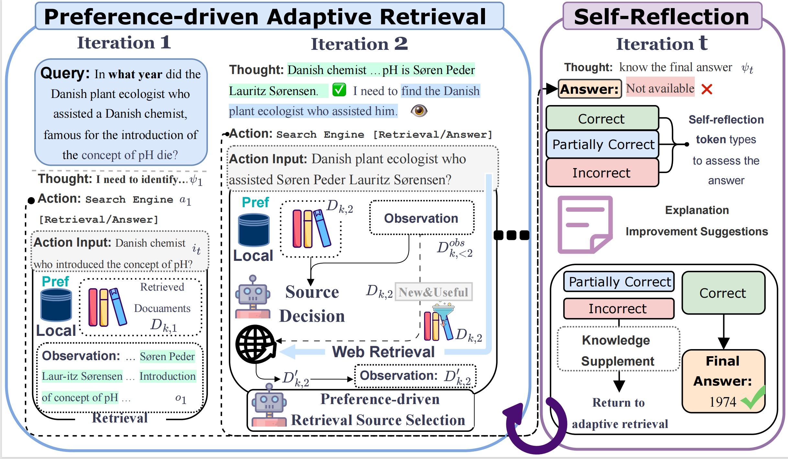

# PrefRAG: Preference-Driven Multi-Source Retrieval Augmented Generation

**PrefRAG** PrefRAG is a novel multi-source ARAG framework, which enhances RAG by enabling in-depth and controllable exploration of diverse retrieval sources through preference-driven adaptive retrieval and self-reflection.




## ⚙️ Environmental Setup
Install the requirements with pip: `pip install -r requirements.txt`. 
For model inference, we recommend using [vLLM](https://github.com/vllm-project/vllm) to significantly speed up the inference process.

## ⚙️ Data Preparation

You can download our standardized datasets (including corpus, training and test sets) by running the command below. For the BioASQ-Y/N corpus, due to its large size, please download it separately from [link](https://huggingface.co/datasets/MedRAG/pubmed).

```bash
bash download/raw_data.sh
```

The data will be downloaded in the `data/`.


## ⚙️ Retriever Setup

We implement two types of retrievers:

**Sparse Retriever**
Based on BM25 algorithm implemented in Elasticsearch
1. Download and install Elasticsearch server
```bash
wget https://artifacts.elastic.co/downloads/elasticsearch/elasticsearch-7.10.2-linux-x86_64.tar.gz
wget https://artifacts.elastic.co/downloads/elasticsearch/elasticsearch-7.10.2-linux-x86_64.tar.gz.sha512
shasum -a 512 -c elasticsearch-7.10.2-linux-x86_64.tar.gz.sha512
tar -xzf elasticsearch-7.10.2-linux-x86_64.tar.gz
cd elasticsearch-7.10.2/
./bin/elasticsearch # Start the server
```
2. Build document index:
```bash
# Take MusiQue dataset as an example
cd src/build_index/es
python index_musique.py
```

**Dense Retriever**
Based on bge-large-en-v1.5 model
1. Download the [bge-large-en-v1.5](https://huggingface.co/BAAI/bge-large-en-v1.5) model
2. Build document embedding index:
```bash
# Take MusiQue dataset as an example
cd src/build_index/emb
python index.py --dataset musique
```


## 🖥️ PrefRAG Training

1. Prepare DPO training dataset:
```bash
# Generate DPO training data with specified dataset and device
python pre_dpo_data.py --output_path ../data/dpo_data --score_model glm4-plus --device 0,1,2,3

# After data generation, use process_data.ipynb to customize the proportion of different data types in the generated training set
```

2. Start training:
```bash
bash train.sh
```

## 📊 Running PrefRAG and Evaluation

```bash
python main.py --method prefrag --retrieve_top_k 5 --dataset musique  --model gpt-4o-mini-2024-07-18 --retrieve_method es
```
The inference process and evaluation results can be found in the output directory.


### Evaluation Result on Each Dataset
Here we present partial experimental results across all datasets, where BM25 is used as the retrieval method with top-k=5 documents retrieved.


| Methods & LLMs | HotpotQA |  |  |  | 2WikiMQA |  |  |  | MuSiQue |  |  |  | BioASQ-Y/N |
|----------------|----------|-----|-----|-------|-----------|-----|-----|-------|----------|-----|-----|-------|------------|
|                | Acc. | F1 | EM | Avg. | Acc. | F1 | EM | Avg. | Acc. | F1 | EM | Avg. | Acc. |
| PrefRAG_Llama3.1-8B-Instruct | 42.0 | 51.1 | 38.8 | 44.0 | 42.0 | 43.2 | 35.8 | 40.3 | 15.4 | 21.0 | 12.8 | 16.4 | 89.6 |
| PrefRAG_GLM4-9B-chat | 45.4 | 56.3 | 42.2 | 48.0 | 55.0 | 53.7 | 42.0 | 50.2 | 23.0 | 29.4 | 20.0 | 24.1 | 87.6 |
| PrefRAG_GPT-4o-mini | 58.6 | 66.0 | 50.4 | 56.6 | 76.2 | 72.1 | 59.4 | 69.2 | 28.2 | 34.3 | 21.2 | 27.9 | 92.8 |
| PrefRAG_GLM4-Plus | 59.0 | 68.4 | 55.0 | 60.8 | 79.6 | 76.7 | 65.2 | 73.8 | 32.2 | 39.4 | 27.4 | 33.0 | 94.0 |

